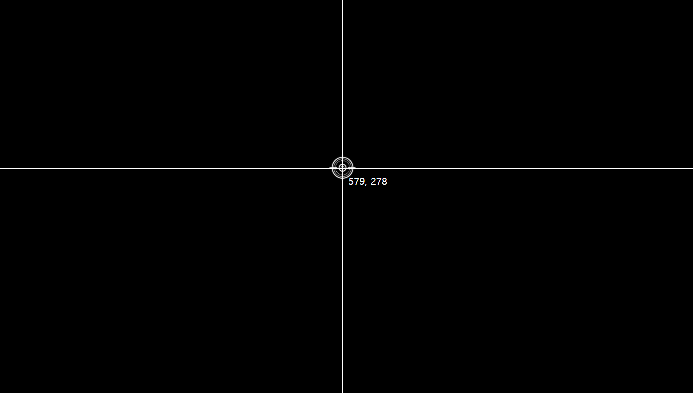

# MouseSniper

<ul>
  <li>Project Name: 마우스 스나이퍼(Mouse Sniper)</li>
<li>사용 언어: HTML, CSS, Vanlila JavaScript</li>
  <li>주요 기능: 마우스의 좌표와 조준점 그림이 마우스를 따라오며 표시됩니다. 
    
<ul>
      <li> mousemove 이벤트를 활용했습니다.</li>
      <li> event가 발생한 x,y 좌표를 활용했습니다.</li>
</ul>

 

